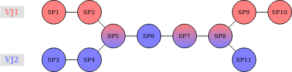
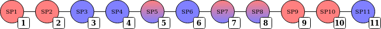

# NTFS to Netex France conversion

Version of the implementation: `1.0`

## Introduction

This document describes how a [NTFS] is transformed into a Netex profil France feed in Navitia Transit Model.

The resulting ZIP archive is composed of:
* a `stop.xml` file containing the description of all stops (Quays and StopPlaces)
* a `network.xml` file containing the description of all networks
* a `resource.xml` file containing the operators, transfers between stops and
  the services
* a `line_*.xml` file for each line, at the root of the archive, containing
  the description of the line itself, its routes, and its service journeys.
  See [line_*.xml](#line_xml) for the exact filename format.

[NTFS]: https://github.com/hove-io/ntfs-specification/blob/master/ntfs_fr.md

## Schema Validation
To validate the produced XML document, you can use `xmllint` tool.  On a
Debian/Ubuntu environment, install the `libxml2-utils` package.

```shell
apt install libxml2-utils
```

On Windows, you can follow [these
instructions](https://stackoverflow.com/questions/19546854/installing-xmllint).

For validation, you need NeTEx schemas.

```shell
git clone https://github.com/NeTEx-CEN/NeTEx.git
```

Then you can validate your file `my_file.xml` against NeTEx schema with the
following command.

```shell
xmllint --noout --nonet --huge --schema /path/to/NeTEx/xsd/NeTEx_publication.xsd my_file.xml
```

## Input parameters

A NTFS feed is not sufficient to generate a valid Netex Profil France feed:
* `ParticipantRef` : The ParticipantRef code must be provided,
* `StopProviderCode` : The code used to identify the provider in the stop_id generation.

## Id of objects

According to the Netex Specification, object identifiers should have a specific formatting.
For the other objects, the following format is used: **FR:[object type]:[object id]:**,
with a replacement of `:` by `_` in `object_id` to avoid conflict between separators.

## File headers

Each Netex file starts with a header containing some information generated by the program:
* `/PublicationDelivery/@version`: always `1.3:FR-NETEX_FRANCE-2.4` (`1.3` =
  Netex XSD version, `2.4` = profile version — see [Frame headers](#frame-headers)
  below for the full format used by individual frames),
* `/PublicationDelivery/PublicationTimestamp`: generation date of the Netex Feed using ISO8601, expressed in Europe/Paris local time,
* `/PublicationDelivery/ParticipantRef`: The value of the corresponding `ParticipantRef` parameter (see [input parameters](#input-parameters)).

Example:

```xml
<?xml version="1.0" encoding="utf-8"?>
<PublicationDelivery version="1.3:FR-NETEX_FRANCE-2.4" xmlns="http://www.netex.org.uk/netex">
<PublicationTimestamp>2019-07-09T11:32:14+02:00</PublicationTimestamp>
<ParticipantRef>ABCD</ParticipantRef>
<dataObjects>...</dataObjects>
</PublicationDelivery>
```

### Frame headers

Each frame (`GeneralFrame` or `CompositeFrame`) inside `dataObjects` also has its own header:
* `@id`: `FR:{frameType}:NETEX_{nnnn}[-{instance}]:` with
  * `{frameType}` is `GeneralFrame` or `CompositeFrame`
  * `{nnnn}` identifies the frame's type ("FRANCE", "COMMUN", "ARRET", "LIGNE", "LIGNE_STRUCTURE", "RESEAU", "HORAIRE", "CALENDRIER" or "TARIF")
  * `{instance}` (optional) ensures uniqueness when the frame type repeats
    once per object (currently the 3 frames of `line_*.xml`).
* `@version`: `{x.y}:FR-NETEX_{nnnn}-{a.b}` with
  * `{x.y}`: the version of Netex XSD of Netex (currently 1.3.2)
  * `{nnnn}`: same frame type identification as `@id` above
  * `{a.b}` is the profile version (2.4)
* `<TypeOfFrameRef ref="FR:TypeOfFrame:NETEX_nnnn:"/>`: first child of the frame, identifying its type,

Example (`network.xml`'s single frame):

```xml
<GeneralFrame id="FR:GeneralFrame:NETEX_RESEAU:" version="1.3:FR-NETEX_RESEAU-2.4">
    <TypeOfFrameRef ref="FR:TypeOfFrame:NETEX_RESEAU:"/>
    <members>...</members>
</GeneralFrame>
```

Example of a `CompositeFrame` wrapping two `GeneralFrame`s (`resource.xml`):

```xml
<CompositeFrame id="FR:CompositeFrame:NETEX_FRANCE:" version="1.3:FR-NETEX_FRANCE-2.4">
    <TypeOfFrameRef ref="FR:TypeOfFrame:NETEX_FRANCE:"/>
    <frames>
        <GeneralFrame id="FR:GeneralFrame:NETEX_COMMUN:" version="1.3:FR-NETEX_COMMUN-2.4">
            <TypeOfFrameRef ref="FR:TypeOfFrame:NETEX_COMMUN:"/>
            <members>...</members>
        </GeneralFrame>
        <GeneralFrame id="FR:GeneralFrame:NETEX_CALENDRIER:" version="1.3:FR-NETEX_CALENDRIER-2.4">
            <TypeOfFrameRef ref="FR:TypeOfFrame:NETEX_CALENDRIER:"/>
            <members>...</members>
        </GeneralFrame>
    </frames>
</CompositeFrame>
```

## stop.xml

A `stop_area` is considered monomodal if all the trips having stop_times referencing any of its stop_points have a physical_mode of the same "Netex mode".

### NeTEx Transport Modes
| physical_mode_id  | TransportMode in Netex |
| ----------------- | ---------------------- |
| Air               | air                    |
| Boat              | water                  |
| Bus               | bus                    |
| BusRapidTransit   | bus                    |
| Coach             | coach                  |
| Ferry             | water                  |
| Funicular         | funicular              |
| LocalTrain        | rail                   |
| LongDistanceTrain | rail                   |
| Metro             | metro                  |
| RapidTransit      | rail                   |
| RailShuttle       | rail                   |
| Shuttle           | bus                    |
| SuspendedCableCar | cableway               |
| Taxi              | _ignored_              |
| Train             | rail                   |
| Tramway           | tram                   |

### Coordinates

The GTFS `stop_lon` and `stop_lat` are specified in WGS84. Every `Location`
(`Centroid/Location` of `Quay`, `StopPlace` and `StopPlaceEntrance`; `Location`
of `RoutePoint` and `ScheduledStopPoint`) carries `Longitude`/`Latitude` in
WGS84 (decimal degrees), as required by the NeTEx France profile.

Example of Netex declaration:

```xml
<Location>
    <Longitude>2.372987</Longitude>
    <Latitude>48.844746</Latitude>
</Location>
```

### Quay

Each `Quay` node corresponds to an NTFS `stop_point` and is of type `ZE`
(__Zone d'embarquement__).  All `Quay` elements are grouped into a `members`
element which itself is wrapped into a `GeneralFrame`.

| Netex field                         | NTFS file        | NTFS field            | Note                                                                                                                                                                                                                                                     |
| ----------------------------------- | ---------------- | --------------------- | -------------------------------------------------------------------------------------------------------------------------------------------------------------------------------------------------------------------------------------------------------- |
| Quay/@id                            | stops.txt        | stop_id               | see [id formatting](#id-of-objects)                                                                                                                                                                                                                      |
| Quay/@version                       |                  |                       | fixed value `any`.                                                                                                                                                                                                                                       |
| Quay/Name                           | stops.txt        | stop_name             |                                                                                                                                                                                                                                                          |
| Quay/Centroid/Location              | stops.txt        | stop_lat and stop_lon | see [Coordinates](#coordinates); if `stop_lat` and `stop_lon` are equals to 0.0, `Centroid` is absent                                                                                                                                                    |
| Quay/AccessibilityAssessment        | stops.txt        | equipment_id          | This node is present only if the `equipment_id` is specified. see [`AccessibilityAssessment`](#accessibilityassessment) below.                                                                                                                           |
| Quay/SiteRef/@ref                   |                  |                       | Reference to the monomodal `StopPlace` it belongs to, for the same mode as `Quay/TransportMode` below; see [id formatting](#id-of-objects)                                                                                                               |
| Quay/TransportMode                  |                  |                       | see (2) below                                                                                                                                                                                                                                            |
| Quay/tariffZones/TariffZoneRef/@ref | stops.txt        | fare_zone_id          | Target is a `FareZone` (see fare.xml); see [id formatting](#id-of-objects). The profile text asks for an element named `FareZoneRef`, but the XSD only allows `TariffZoneRef` at this position (`tariffZoneRefs_RelStructure`); `TariffZoneRef` is kept. |
| Quay/PublicCode                     | stops.txt        | stop_code             | This node may not be present if the stop_point has no `stop_code`.                                                                                                                                                                                       |
| Quay/keyList/KeyValue/Value         | object_codes.txt | object_code           | Present only if a code with `object_system` = `source` exists for this `stop_point`; `typeOfKey` is fixed to `ALTERNATE_IDENTIFIER` and `Key` is fixed to `source`                                                                                       |

**(2) definition of the TransportMode**
As a stop_point can be associated to several physical_modes, all the
physical_modes need to be mapped to the Netex list (see [NeTEx Transport
Modes](#netex-transport-modes)).
If more than one Netex mode is associated, use the mode of __highest priority__ (see [NTFS
specifications](https://github.com/hove-io/ntfs-specification/blob/v0.11.2/ntfs_fr.md#physical_modestxt-requis)).


#### AccessibilityAssessment

If a `Quay` (`stop_point`), a multimodal `StopPlace` (`stop_area`) or a `StopPlaceEntrance` (`stop_location`) is associated to an equipment, a node `AccessibilityAssessment` is created and its content is as follow. `StopPlaceEntrance` only ever carries the `WheelchairAccess` limitation (see table below).

| Netex field                                                                         | NTFS file      | NTFS field           | Note                                                                                                                                                     |
| ----------------------------------------------------------------------------------- | -------------- | -------------------- | -------------------------------------------------------------------------------------------------------------------------------------------------------- |
| AccessibilityAssessment/@id                                                         | stops.txt      |                      | The id is built from the concatenation (joined with _) of the stop_id and the equipment_id. For the rest of the id, use [id formatting](#id-of-objects). |
| AccessibilityAssessment/@version                                                    |                |                      | fixed value `any`.                                                                                                                                       |
| AccessibilityAssessment/MobilityImpairedAccess                                      |                |                      | see (1) below                                                                                                                                            |
| AccessibilityAssessment/limitations/AccessibilityLimitation/WheelchairAccess        | equipments.txt | wheelchair_boarding  | see (2) below                                                                                                                                            |
| AccessibilityAssessment/limitations/AccessibilityLimitation/AudibleSignalsAvailable | equipments.txt | audible_announcement | see (2) below; not present on `StopPlaceEntrance`                                                                                                        |
| AccessibilityAssessment/limitations/AccessibilityLimitation/VisualSignsAvailable    | equipments.txt | visual_announcement  | see (2) below; not present on `StopPlaceEntrance`                                                                                                        |

**(1) definition of MobilityImpairedAccess**

As stated in `NF_Profil NeTEx éléments communs(F) - v2.1.pdf` in chapter 5.10:
`AccessibilityAssessment` is optional, but if it's present, `MobilityImpairedAccess` is mandatory. Therefore, `MobilityImpairedAccess` should be set to:
* `true` if all `AccessibilityLimitation` are set to `true`
* `false` if all `AccessibilityLimitation` are set to `false`
* `partial` if some `AccessibilityLimitation` are set to `true`
* `unknown` in other cases

**(2) value of limitations**

| NTFS accessibility value | Netex accessibility value |
| ------------------------ | ------------------------- |
| 0 or undefined           | `unknown`                  |
| 1                        | `true`                    |
| 2                        | `false`                   |

Example:

```xml
<Quay id="FR:Quay:Q1:" version="any">
	<keyList>
		<KeyValue typeOfKey="ALTERNATE_IDENTIFIER">
			<Key>source</Key>
			<Value>Q1</Value>
		</KeyValue>
	</keyList>
	<Name>Quay 1</Name>
	<Centroid>
		<Location>
			<Longitude>2.5</Longitude>
			<Latitude>48.8</Latitude>
		</Location>
	</Centroid>
	<AccessibilityAssessment id="FR:AccessibilityAssessment:Q1_E1:" version="any">
		<MobilityImpairedAccess>true</MobilityImpairedAccess>
		<limitations>
			<AccessibilityLimitation>
				<WheelchairAccess>true</WheelchairAccess>
				<AudibleSignalsAvailable>true</AudibleSignalsAvailable>
				<VisualSignsAvailable>true</VisualSignsAvailable>
			</AccessibilityLimitation>
		</limitations>
	</AccessibilityAssessment>
	<SiteRef ref="FR:StopPlace:S1_bus:" />
	<TransportMode>bus</TransportMode>
	<tariffZones>
		<TariffZoneRef ref="FR:FareZone:Z1:" />
	</tariffZones>
	<PublicCode>Q1</PublicCode>
</Quay>
```

### StopPlace
`StopPlace` is of 2 different types:
* `LMO` (__Lieu d'arrêt mono-modal__): Mono-modal with a unique name, regrouping
  `Quay`
* `LMU` (__Lieu d'arrêt multi-modal__): Multi-modal, regrouping multiple
  `StopPlace` of type `LMO` or `PM`

`stop_area` can be associated to several `physical_mode`.  All the
`physical_modes` need to be mapped to the Netex list (see [NeTEx Transport
Modes](#netex-transport-modes)).  For each mode, a `StopPlace` of type `LMO` is
created.  An additionnal `LMU` is created to regroup them.

Station entrances/exits (stops with `location_type` = 3) are defined in a multimodal `StopPlace` to which they belong.

#### StopPlaceType mapping
The `StopPlace/StopPlaceType` is defined from its `StopPlace/TransportMode`.

| NeTEx Mode | StopPlaceType |
| ---------- | ------------- |
| air        | Airport       |
| bus        | onstreetBus   |
| cableway   | liftStation   |
| coach      | coachStation  |
| funicular  | metroStation  |
| metro      | metroStation  |
| rail       | railStation   |
| tram       | tramStation   |
| water      | ferryStop     |

#### Monomodal StopPlace

| Netex field                         | NTFS file | NTFS field            | Note                                                                                                                                                      |
| ----------------------------------- | --------- | --------------------- | ---------------------------------------------------------------------------------------------------------------------------------------------------------- |
| StopPlace/@id                       | stops.txt | stop_id               | `stop_id` suffixed with `_` and the NeTEx mode (see [NeTEx Transport Modes](#netex-transport-modes)), then formatted per [id formatting](#id-of-objects) |
| StopPlace/@version                  |           |                       | fixed value `any`.                                                                                                                                       |
| StopPlace/Name                      | stops.txt | stop_name             |                                                                                                                                                          |
| StopPlace/Centroid/Location         | stops.txt | stop_lat and stop_lon | see [Coordinates](#coordinates); if `stop_lat` and `stop_lon` are equals to 0.0, `Centroid` is absent                                                    |
| StopPlace/placeTypes/TypeOfPlaceRef |           |                       | fixed value `monomodalStopPlace`                                                                                                                         |
| StopPlace/ParentSiteRef             |           |                       | link to the corresponding Multimodal `StopPlace`                                                                                                         |
| StopPlace/TransportMode             |           |                       | use the only NeTEx mode                                                                                                                                  |
| StopPlace/StopPlaceType             |           |                       | see the section [StopPlaceType mapping](#stopplacetype-mapping)                                                                                          |
| StopPlace/quays/QuayRef[]/@ref      |           |                       | see [id formatting](#id-of-objects)                                                                                                                      |

Example:

```xml
<StopPlace id="FR:StopPlace:S1_bus:" version="any">
	<Name>Stop Place 1</Name>
	<Centroid>
		<Location>
			<Longitude>2.5</Longitude>
			<Latitude>48.8</Latitude>
		</Location>
	</Centroid>
	<placeTypes>
		<TypeOfPlaceRef ref="monomodalStopPlace" />
	</placeTypes>
	<ParentSiteRef ref="FR:StopPlace:S1:" />
	<TransportMode>bus</TransportMode>
	<StopPlaceType>onstreetBus</StopPlaceType>
	<quays>
		<QuayRef ref="FR:Quay:Q1:" />
	</quays>
</StopPlace>
```

#### Multimodal StopPlace

| Netex field                            | NTFS file        | NTFS field            | Note                                                                                                                                                              |
| -------------------------------------- | ---------------- | --------------------- | ----------------------------------------------------------------------------------------------------------------------------------------------------------------- |
| StopPlace/@id                          | stops.txt        | stop_id               | see [id formatting](#id-of-objects)                                                                                                                               |
| StopPlace/@version                     |                  |                       | fixed value `any`.                                                                                                                                                |
| StopPlace/Name                         | stops.txt        | stop_name             |                                                                                                                                                                   |
| StopPlace/Centroid/Location            | stops.txt        | stop_lat and stop_lon | see [Coordinates](#coordinates); if `stop_lat` and `stop_lon` are equals to 0.0, `Centroid` is absent                                                             |
| StopPlace/placeTypes/TypeOfPlaceRef    |                  |                       | fixed value `multimodalStopPlace`                                                                                                                                 |
| StopPlace/AccessibilityAssessment      | stops.txt        | equipment_id          | This node is present only if the `equipment_id` is specified. see [`AccessibilityAssessment`](#accessibilityassessment) below.                                    |
| StopPlace/entrances/EntranceRef[]/@ref |                  |                       | Reference to the `StopPlaceEntrance` object(s) of this station, if any; see [StopPlaceEntrance](#stopplaceentrance)                                               |
| StopPlace/TransportMode                |                  |                       | use the mode of __highest priority__ (see [NTFS specifications](https://github.com/hove-io/ntfs-specification/blob/v0.11.2/ntfs_fr.md#physical_modestxt-requis))  |
| StopPlace/StopPlaceType                |                  |                       | see the section [StopPlaceType mapping](#stopplacetype-mapping)                                                                                                   |
| StopPlace/keyList/KeyValue/Value       | object_codes.txt | object_code           | Present only if a code with `object_system` = `source` exists for this `stop_area`; `typeOfKey` is fixed to `ALTERNATE_IDENTIFIER` and `Key` is fixed to `source` |

Example:

```xml
<StopPlace id="FR:StopPlace:S1:" version="any">
	<keyList>
		<KeyValue typeOfKey="ALTERNATE_IDENTIFIER">
			<Key>source</Key>
			<Value>S1</Value>
		</KeyValue>
	</keyList>
	<Name>Stop Place 1</Name>
	<Centroid>
		<Location>
			<Longitude>2.5</Longitude>
			<Latitude>48.8</Latitude>
		</Location>
	</Centroid>
	<placeTypes>
		<TypeOfPlaceRef ref="multimodalStopPlace" />
	</placeTypes>
	<AccessibilityAssessment id="FR:AccessibilityAssessment:S1_Eq1:" version="any">
		<MobilityImpairedAccess>true</MobilityImpairedAccess>
		<limitations>
			<AccessibilityLimitation>
				<WheelchairAccess>true</WheelchairAccess>
				<AudibleSignalsAvailable>true</AudibleSignalsAvailable>
				<VisualSignsAvailable>true</VisualSignsAvailable>
			</AccessibilityLimitation>
		</limitations>
	</AccessibilityAssessment>
	<entrances>
		<EntranceRef ref="FR:StopPlaceEntrance:E1:" />
	</entrances>
	<TransportMode>bus</TransportMode>
	<StopPlaceType>onstreetBus</StopPlaceType>
</StopPlace>
```

#### StopPlaceEntrance
A `StopPlaceEntrance` node is created for each entrance/exit (stop with `location_type` = 3).

| Netex field                               | NTFS file | NTFS field            | Note                                                                                                                                                                               |
| ----------------------------------------- | --------- | --------------------- | ---------------------------------------------------------------------------------------------------------------------------------------------------------------------------------- |
| StopPlaceEntrance/@id                     | stops.txt | stop_id               | see [id formatting](#id-of-objects)                                                                                                                                                |
| StopPlaceEntrance/@version                |           |                       | fixed value `any`.                                                                                                                                                                 |
| StopPlaceEntrance/Name                    | stops.txt | stop_name             |                                                                                                                                                                                    |
| StopPlaceEntrance/Centroid/Location       | stops.txt | stop_lat and stop_lon | see [Coordinates](#coordinates); if `stop_lat` and `stop_lon` are equals to 0.0, `Centroid` is absent                                                                              |
| StopPlaceEntrance/AccessibilityAssessment | stops.txt | equipment_id          | This node is present only if the `equipment_id` is specified; only the `WheelchairAccess` limitation is included. see [`AccessibilityAssessment`](#accessibilityassessment) below. |
| StopPlaceEntrance/SiteRef/@ref            |           |                       | Reference to the multimodal `StopPlace` it belongs to; see [id formatting](#id-of-objects)                                                                                         |
| StopPlaceEntrance/PublicCode              | stops.txt | stop_code             | This node may not be present if the stop_location has no `stop_code`.                                                                                                              |
| StopPlaceEntrance/IsEntry                 |           |                       | fixed value `true`                                                                                                                                                                 |
| StopPlaceEntrance/IsExit                  |           |                       | fixed value `true`                                                                                                                                                                 |

Example:

```xml
<StopPlaceEntrance id="FR:StopPlaceEntrance:E1:" version="any">
	<Name>Entrance 1</Name>
	<Centroid>
		<Location>
			<Longitude>2.5</Longitude>
			<Latitude>48.8</Latitude>
		</Location>
	</Centroid>
	<AccessibilityAssessment id="FR:AccessibilityAssessment:E1_Eq2:" version="any">
		<MobilityImpairedAccess>true</MobilityImpairedAccess>
		<limitations>
			<AccessibilityLimitation>
				<WheelchairAccess>true</WheelchairAccess>
			</AccessibilityLimitation>
		</limitations>
	</AccessibilityAssessment>
	<SiteRef ref="FR:StopPlace:S1:" />
	<PublicCode>E1</PublicCode>
	<IsEntry>true</IsEntry>
	<IsExit>true</IsExit>
</StopPlaceEntrance>
```

## network.xml

### Top level structure

Example:

```xml
<?xml version="1.0" encoding="utf-8"?>
<GeneralFrame
			id="FR:GeneralFrame:NETEX_RESEAU:"
			version="1.3:FR-NETEX_RESEAU-2.4">
	<TypeOfFrameRef ref="FR:TypeOfFrame:NETEX_RESEAU:"/>
	<members><!-- One node Network for each network of the dataset --></members>
</GeneralFrame>
```

### Network

| Netex field                    | NTFS file        | NTFS field   | Note                                                                                                                                                            |
| ------------------------------ | ---------------- | ------------ | --------------------------------------------------------------------------------------------------------------------------------------------------------------- |
| Network/@id                    | networks.txt     | network_id   | see [id formatting](#id-of-objects)                                                                                                                             |
| Network/@version               |                  |              | fixed value `any`                                                                                                                                               |
| Network/Name                   | networks.txt     | network_name |                                                                                                                                                                 |
| Network/members/LineRef[]/@ref | lines.txt        | line_id      | see [id formatting](#id-of-objects)                                                                                                                             |
| Network/keyList/KeyValue/Value | object_codes.txt | object_code  | Present only if a code with `object_system` = `source` exists for this `network`; `typeOfKey` is fixed to `ALTERNATE_IDENTIFIER` and `Key` is fixed to `source` |

Example:

```xml
<Network id="FR:Network:N1:" version="any">
	<keyList>
		<KeyValue typeOfKey="ALTERNATE_IDENTIFIER">
			<Key>source</Key>
			<Value>N1</Value>
		</KeyValue>
	</keyList>
	<Name>Network 1</Name>
	<members>
		<!-- One LineRef for each line of the network -->
		<LineRef ref="FR:Line:L1:" />
	</members>
</Network>
```

## resource.xml

### Top level structure

Example:

```xml
<?xml version="1.0" encoding="utf-8"?>
<CompositeFrame id="FR:CompositeFrame:NETEX_FRANCE:" version="1.3:FR-NETEX_FRANCE-2.4">
	<TypeOfFrameRef ref="FR:TypeOfFrame:NETEX_FRANCE:" />
	<frames>
		<GeneralFrame id="FR:GeneralFrame:NETEX_COMMUN:" version="1.3:FR-NETEX_COMMUN-2.4">
			<TypeOfFrameRef ref="FR:TypeOfFrame:NETEX_COMMUN:" />
			<members>
				<!-- One node Operator for each company of the dataset -->
				<Operator />
				<!-- One SiteConnection for each transfer in transfers.txt -->
				<SiteConnection>
					<WalkTransferDuration>
						<DefaultDuration><!-- Walking connecting time --></DefaultDuration>
					</WalkTransferDuration>
					<From>
						<!-- Origin stop of the connection -->
						<StopPlaceRef />
						<QuayRef />
					</From>
					<To>
						<!-- End stop of the connection -->
						<StopPlaceRef />
						<QuayRef />
					</To>
				</SiteConnection>
			</members>
		</GeneralFrame>
		<GeneralFrame id="FR:GeneralFrame:NETEX_CALENDRIER:" version="1.3:FR-NETEX_CALENDRIER-2.4">
			<ValidBetween>
				<FromDate>2020-01-01T00:00:00</FromDate>
				<ToDate>2020-12-30T23:59:59</ToDate>
			</ValidBetween>
			<TypeOfFrameRef ref="FR:TypeOfFrame:NETEX_CALENDRIER:" />
			<FrameDefaults>
				<DefaultLocale>
					<TimeZone>Europe/Paris</TimeZone>
				</DefaultLocale>
			</FrameDefaults>
			<members>
				<!-- One DayType for each 'service_id' -->
				<DayType />
				<!-- One DayTypeAssignment for each 'service_id' to link
				     a DayType and a UicOperatingPeriod -->
				<DayTypeAssignment />
				<!-- One UicOperatingPeriod for each 'service_id' -->
				<UicOperatingPeriod />
			</members>
		</GeneralFrame>
	</frames>
</CompositeFrame>
```

### Operator

| Netex field                     | NTFS file        | NTFS field    | Note                                                                                                                                                            |
| ------------------------------- | ---------------- | ------------- | --------------------------------------------------------------------------------------------------------------------------------------------------------------- |
| Operator/@id                    | companies.txt    | company_id    | see [id formatting](#id-of-objects)                                                                                                                             |
| Operator/@version               |                  |               | fixed value `any`                                                                                                                                               |
| Operator/Name                   | companies.txt    | company_name  |                                                                                                                                                                 |
| Operator/ContactDetails/Email   | companies.txt    | company_mail  |                                                                                                                                                                 |
| Operator/ContactDetails/Phone   | companies.txt    | company_phone |                                                                                                                                                                 |
| Operator/ContactDetails/Url     | companies.txt    | company_url   |                                                                                                                                                                 |
| Operator/OrganisationType       | companies.txt    | company_role  | `"authority"` if `company_role = Authority`, `"operator"` if `company_role = Operator`                                                                          |
| Operator/keyList/KeyValue/Value | object_codes.txt | object_code   | Present only if a code with `object_system` = `source` exists for this `company`; `typeOfKey` is fixed to `ALTERNATE_IDENTIFIER` and `Key` is fixed to `source` |

Example:

```xml
<Operator id="FR:Operator:O1:" version="any">
	<keyList>
		<KeyValue typeOfKey="ALTERNATE_IDENTIFIER">
			<Key>source</Key>
			<Value>O1</Value>
		</KeyValue>
	</keyList>
	<Name>Operator 1</Name>
	<ContactDetails>
		<Email>operator1@example.com</Email>
		<Phone>0123456789</Phone>
		<Url>https://www.example.com</Url>
	</ContactDetails>
	<OrganisationType>authority</OrganisationType>
</Operator>
```

### SiteConnection

Each connection between two stops in `transfers.txt` produces a `SiteConnection` element with the `From` and `To` nodes of the connection as well as a `WalkTransferDuration` node.

| Netex field                                         | NTFS file     | NTFS field        | Note                                                                                                                                                                          |
| --------------------------------------------------- | ------------- | ----------------- | ----------------------------------------------------------------------------------------------------------------------------------------------------------------------------- |
| SiteConnection/@id                                  |               |                   | The id is built from the concatenation (joined with `_`) of the origin and end `stop_id` used in the connection. For the rest of the id, use [id formatting](#id-of-objects). |
| SiteConnection/@version                             |               |                   | Fixed value `any`.                                                                                                                                                            |
| SiteConnection/WalkTransferDuration/DefaultDuration | transfers.txt | min_transfer_time | Time is given as a [duration](https://en.wikipedia.org/wiki/ISO_8601#Durations) (e.g. PT120S for a transfer time of 2 minutes).                                               |
| SiteConnection/From/StopPlaceRef/@ref               |               |                   | Id of the multimodal `StopPlace` that contains the origin `Quay` of the connection. See [id formatting](#id-of-objects).                                                      |
| SiteConnection/From/QuayRef/@ref                    | transfers.txt | from_stop_id      | Id of the origin `Quay` of the connection. See [id formatting](#id-of-objects).                                                                                               |
| SiteConnection/To/StopPlaceRef/@ref                 |               |                   | Id of the multimodal `StopPlace` that contains the end `Quay` of the connection. See [id formatting](#id-of-objects).                                                         |
| SiteConnection/To/QuayRef/@ref                      | transfers.txt | to_stop_id        | Id of the end `Quay` of the connection. See [id formatting](#id-of-objects).                                                                                                  |

Example:

```xml
<SiteConnection id="FR:SiteConnection:S1_S2:" version="any">
	<WalkTransferDuration>
		<DefaultDuration>PT120S</DefaultDuration>
	</WalkTransferDuration>
	<From>
		<StopPlaceRef ref="FR:StopPlace:S1:" />
		<QuayRef ref="FR:Quay:S1Q:" />
	</From>
	<To>
		<StopPlaceRef ref="FR:StopPlace:S2:" />
		<QuayRef ref="FR:Quay:S2Q:" />
	</To>
</SiteConnection>
```

### ValidBetween

| Netex field           | NTFS file    | NTFS field | Note                                                                                                                                                                         |
| --------------------- | ------------ | ---------- | ---------------------------------------------------------------------------------------------------------------------------------------------------------------------------- |
| ValidBetween/FromDate | datasets.txt | start_date | minimum from all datasets' `start_date`; use ISO-8601 date-time format with a time of `00:00:00`, no timezone suffix (see `FrameDefaults`/`TimeZone` on the enclosing frame) |
| ValidBetween/ToDate   | datasets.txt | end_date   | maximum from all datasets' `end_date`; use ISO-8601 date-time format with a time of `23:59:59`, no timezone suffix                                                           |

### FrameDefaults

| Netex field                          | NTFS file | NTFS field | Note                       |
| ------------------------------------ | --------- | ---------- | -------------------------- |
| FrameDefaults/DefaultLocale/TimeZone |           |            | fixed value `Europe/Paris` |

Each `service_id` produce a set of three objects:
* `DayType`
* `DayTypeAssignment`
* `UicOperatingPeriod`

### DayType

The `DayType` must exist even if intentionally left empty (it is referred to by
`ServiceJourney`).

| Netex field      | NTFS file                          | NTFS field | Note                                |
| ---------------- | ---------------------------------- | ---------- | ----------------------------------- |
| DayType/@id      | calendar.txt or calendar_dates.txt | service_id | see [id formatting](#id-of-objects) |
| DayType/@version |                                    |            | fixed value `any`                   |

### DayTypeAssignment

| Netex field                               | NTFS file    | NTFS field | Note                                                                      |
| ----------------------------------------- | ------------ | ---------- | ------------------------------------------------------------------------- |
| DayTypeAssignment/@id                     | calendar.txt | service_id | see [id formatting](#id-of-objects)                                       |
| DayTypeAssignment/@version                |              |            | fixed value `any`                                                         |
| DayTypeAssignment/@order                  |              |            | fixed value `1`                                                           |
| DayTypeAssignment/OperatingPeriodRef/@ref | calendar.txt | service_id | see [id formatting](#id-of-objects) with `OperatingPeriod` as object type |
| DayTypeAssignment/DayTypeRef/@ref         | calendar.txt | service_id | see [id formatting](#id-of-objects) with `DayType` as object type         |

### UicOperatingPeriod

| Netex field                     | NTFS file    | NTFS field | Note                                                                              |
| ------------------------------- | ------------ | ---------- | --------------------------------------------------------------------------------- |
| UicOperatingPeriod/@id          | calendar.txt | service_id | see [id formatting](#id-of-objects) with `OperatingPeriod` as object type         |
| UicOperatingPeriod/@version     |              |            | fixed value `any`                                                                 |
| UicOperatingPeriod/FromDate     | calendar.txt | start_date | use ISO-8601 date-time format, using `T00:00:00` for the time, no timezone suffix |
| UicOperatingPeriod/ToDate       | calendar.txt | end_date   | use ISO-8601 date-time format, using `T23:59:59` for the time, no timezone suffix |
| UicOperatingPeriod/ValidDayBits |              |            | see (1) below                                                                     |

**(1) Sequence for ValidDayBits**

This is a string sequence of `0` (inactive days) and `1` (active days).  The
sequence should contains as many `0/1` as there is days in the period.  The
first character correspond to the first day of the period.

Example:

```xml
<DayType id="FR:DayType:D1:" version="any" />
<DayTypeAssignment id="FR:DayTypeAssignment:D1:" order="1" version="any">
	<OperatingPeriodRef ref="FR:UicOperatingPeriod:D1:" />
	<DayTypeRef ref="FR:DayType:D1:" />
</DayTypeAssignment>
<UicOperatingPeriod id="FR:UicOperatingPeriod:D1:" version="any">
	<FromDate>2020-01-01T00:00:00</FromDate>
	<ToDate>2020-01-07T23:59:59</ToDate>
	<ValidDayBits>1111100</ValidDayBits>
</UicOperatingPeriod>
```

## line_*.xml

### Filename

The filename is built from the following segments, joined with `_`:
* fixed value `line`
* the network's name, or its id if the name produces an empty segment (e.g. non-Latin script)
* the line's `line_code`, if set
* the line's `line_name`, if set and different from the previous segment

Each segment above is lowercased, stripped of accents, and has any run of
non-alphanumeric characters collapsed to a single `_`. The whole name is then
suffixed with `_` and the MD5 checksum of the `line_id`, and the `.xml`
extension.

Example: for a network named `Example Transit`, a line with `line_code` =
`A1`, `line_name` = `Red Line` and `line_id` = `RL1`, the filename is
`line_example_transit_a1_red_line_452c96e233e517c3c970426d6baed84e.xml`.

### Top level structure

Example:

```xml
<?xml version="1.0" encoding="utf-8"?>
<CompositeFrame id="FR:CompositeFrame:NETEX_LIGNE-{instance}:" version="1.3:FR-NETEX_LIGNE-2.4">
	<TypeOfFrameRef ref="FR:TypeOfFrame:NETEX_LIGNE:" />
	<frames>
		<GeneralFrame id="FR:GeneralFrame:NETEX_LIGNE_STRUCTURE-{instance}:" version="1.3:FR-NETEX_LIGNE_STRUCTURE-2.4">
			<TypeOfFrameRef ref="FR:TypeOfFrame:NETEX_LIGNE_STRUCTURE:" />
			<members>
				<!-- The Line itself, then its Route(s), RoutePoint(s),
				     ServiceJourneyPattern(s), ScheduledStopPoint(s) and
				     PassengerStopAssignment(s) -->
				<Line />
			</members>
		</GeneralFrame>
		<GeneralFrame id="FR:GeneralFrame:NETEX_HORAIRE-{instance}:" version="1.3:FR-NETEX_HORAIRE-2.4">
			<TypeOfFrameRef ref="FR:TypeOfFrame:NETEX_HORAIRE:" />
			<FrameDefaults>
				<DefaultLocale>
					<TimeZone>Europe/Paris</TimeZone>
				</DefaultLocale>
			</FrameDefaults>
			<members>
				<!-- One ServiceJourney for each 'trip_id' of the line -->
				<ServiceJourney />
			</members>
		</GeneralFrame>
	</frames>
</CompositeFrame>
```

`{instance}` ensures uniqueness across the whole export, since the 3 frames
above are repeated once per line. Here, it is the MD5 checksum of the
`line_id`, and is the same value for all 3 frames of a given `line_*.xml`
file.

### FrameDefaults

| Netex field                          | NTFS file | NTFS field | Note                       |
| ------------------------------------ | --------- | ---------- | -------------------------- |
| FrameDefaults/DefaultLocale/TimeZone |           |            | fixed value `Europe/Paris` |

### Line

| Netex field                  | NTFS file        | NTFS field      | Note                                                                                                                                                                                                                                                             |
| ---------------------------- | ---------------- | --------------- | ---------------------------------------------------------------------------------------------------------------------------------------------------------------------------------------------------------------------------------------------------------------- |
| Line/@id                     | lines.txt        | line_id         | see [id formatting](#id-of-objects)                                                                                                                                                                                                                              |
| Line/@version                |                  |                 | fixed value `any`                                                                                                                                                                                                                                                |
| Line/Name                    | lines.txt        | line_name       |                                                                                                                                                                                                                                                                  |
| Line/TransportMode           |                  |                 | Refers to the mode with __highest priority__  of the trips associated to the line, see [NeTEx Transport Modes](#netex-transport-modes) and [NTFS specifications](https://github.com/hove-io/ntfs-specification/blob/v0.11.2/ntfs_fr.md#physical_modestxt-requis) |
| Line/PublicCode              | lines.txt        | line_code       | If the code line_code is empty, this node is not created.                                                                                                                                                                                                        |
| Line/Presentation/Colour     | lines.txt        | line_color      | RGB hexadecimal, 6 characters. Omitted if empty. The `Presentation` node is created only if `line_color` or `line_text_color` is set.                                                                                                                            |
| Line/Presentation/TextColour | lines.txt        | line_text_color | RGB hexadecimal, 6 characters. Omitted if empty. The `Presentation` node is created only if `line_color` or `line_text_color` is set.                                                                                                                            |
| Line/keyList/KeyValue/Value  | object_codes.txt | object_code     | Present only if a code with `object_system` = `source` exists for this `line`; `typeOfKey` is fixed to `ALTERNATE_IDENTIFIER` and `Key` is fixed to `source`                                                                                                     |

Example:

```xml
<Line id="FR:Line:L1:" version="any">
	<keyList>
		<KeyValue typeOfKey="ALTERNATE_IDENTIFIER">
			<Key>source</Key>
			<Value>L1</Value>
		</KeyValue>
	</keyList>
	<Name>Line 1</Name>
	<TransportMode>bus</TransportMode>
	<PublicCode>1</PublicCode>
	<Presentation>
		<Colour>FF0000</Colour>
		<TextColour>FFFFFF</TextColour>
	</Presentation>
</Line>
```

### Route

| Netex field                           | NTFS file        | NTFS field     | Note                                                                                                                                                          |
| ------------------------------------- | ---------------- | -------------- | ------------------------------------------------------------------------------------------------------------------------------------------------------------- |
| Route/@id                             | routes.txt       | route_id       | see [id formatting](#id-of-objects)                                                                                                                           |
| Route/@version                        |                  |                | fixed value `any`                                                                                                                                             |
| Route/Name                            | routes.txt       | route_name     |                                                                                                                                                               |
| Route/Distance                        |                  |                | fixed value `0` (mandatory field in NeTEx France `LinkSequence`)                                                                                              |
| Route/LineRef/@ref                    | routes.txt       | line_id        | see [id formatting](#id-of-objects) with `Line` as object type                                                                                                |
| Route/DirectionType                   | routes.txt       | direction_type | see (1) below                                                                                                                                                 |
| Route/pointsInSequence/PointOnRoute[] |                  |                | see [`PointOnRoute`](#pointonroute)                                                                                                                           |
| Route/keyList/KeyValue/Value          | object_codes.txt | object_code    | Present only if a code with `object_system` = `source` exists for this `route`; `typeOfKey` is fixed to `ALTERNATE_IDENTIFIER` and `Key` is fixed to `source` |

**(1) Direction Type**

Use the following mapping to convert the direction type from NTFS to NeTEx
France.

| NTFS Direction Type | NeTEx Direction Type |
| ------------------- | -------------------- |
| forward             | inbound              |
| backward            | outbound             |
| inbound             | inbound              |
| outbound            | outbound             |
| clockwise           | clockwise            |
| anticlockwise       | anticlockwise        |

Example:

```xml
<Route id="FR:Route:R1:" version="any">
	<keyList>
		<KeyValue typeOfKey="ALTERNATE_IDENTIFIER">
			<Key>source</Key>
			<Value>R1</Value>
		</KeyValue>
	</keyList>
	<Name>Route 1</Name>
	<Distance>0</Distance>
	<LineRef ref="FR:Line:L1:" />
	<DirectionType>inbound</DirectionType>
	<pointsInSequence>
		<PointOnRoute id="FR:PointOnRoute:R1_1:" order="1" version="any">
			<RoutePointRef ref="FR:RoutePoint:R1_1:" />
		</PointOnRoute>
		<PointOnRoute id="FR:PointOnRoute:R1_2:" order="2" version="any">
			<RoutePointRef ref="FR:RoutePoint:R1_2:" />
		</PointOnRoute>
	</pointsInSequence>
</Route>
```

#### PointOnRoute

For each `stop_point` of all the `vehicle_journey` of the current `route`, a
`PointOnRoute` is created, with a link to a corresponding `RoutePoint` (see
[related section](#routepoint)).

| Netex field                     | NTFS file | NTFS field | Note                                                                                             |
| ------------------------------- | --------- | ---------- | ------------------------------------------------------------------------------------------------ |
| PointOnRoute/@id                |           |            | see (1) below                                                                                    |
| PointOnRoute/@version           |           |            | fixed value `any`                                                                                |
| PointOnRoute/@order             |           |            | see (2) below                                                                                    |
| PointOnRoute/RoutePointRef/@ref |           |            | see (1) below; see [id formatting](#id-of-objects) with `RoutePoint` as object type for the rest |

**(1) identifier for PointOnRoute**

The identifier is built from the concatenation of the following fields separated
by `_`:
* the `route_id`
* the `@order`

For the rest of the identifier, use [id formatting](#id-of-objects).

**(2) `@order` of the PointOnRoute**

All the `stop_point` of the `route` are inserted with the following rules
(`@order` is auto-incremented from `1`).

The `vehicle_journeys` are processed in order. The ordering is done using the
following keys in this order of priority:
1. `stop_time[0].stop_id`: the `stop_point` of the first `stop_time` of the
   `vehicle_journey`
2. `stop_time[0].departure_time`: the `departure_time` of the first `stop_time`
   of the `vehicle_journey`
All the `stop_points` of the first `vehicle_journey` are inserted
in the list of `PointOnRoute`. Then, for the second `vehicle_journey`, insert
only the `stop_points` that are not already present, but in a manner that the
order of the `stop_points` in the `vehicle_journey` is preserved (priority to
the `stop_points` of the previous `vehicle_journeys`).

Below is an example with 2 `vehicle_journeys`, `VJ1` (in red) and `VJ2` (in
blue); `stop_points` are colored accordingly (mixed colors means they're part of
both `vehicle_journeys`).



Below is the final sequence of `PointOnRoute` with their corresponding order.



### RoutePoint

One `RoutePoint` is created for each `stop_point` of all `vehicle_journeys` of a
`Route`.

| Netex field         | NTFS file | NTFS field            | Note                                                                                                                        |
| ------------------- | --------- | --------------------- | --------------------------------------------------------------------------------------------------------------------------- |
| RoutePoint/@id      |           |                       | see [`PointOnRoute/@id`](#pointonroute) with `RoutePoint` as object type                                                    |
| RoutePoint/@version |           |                       | fixed value `any`                                                                                                           |
| RoutePoint/Location | stops.txt | stop_lat and stop_lon | see [Coordinates](#coordinates); if `stop_lat` and `stop_lon` are equals to 0.0, `Location` is absent |

Example:

```xml
<RoutePoint id="FR:RoutePoint:R1_1:" version="any">
	<Location>
		<Longitude>2.5</Longitude>
		<Latitude>48.8</Latitude>
	</Location>
</RoutePoint>
```

### ServiceJourneyPattern

A Journey Pattern is created for each unique sequence of stops in the Vehicle
Journeys. Unicity applies to:
* `stop_id`
* `pickup_type`
* `drop_off_type`
* `local_zone_id`

| Netex field                                                        | Note                                                                                  |
| ------------------------------------------------------------------ | ------------------------------------------------------------------------------------- |
| ServiceJourneyPattern/@id                                          | see [id formatting](#id-of-objects) using the first `trip_id` in alphanumerical order |
| ServiceJourneyPattern/@version                                     | fixed value `any`                                                                     |
| ServiceJourneyPattern/Distance                                     | fixed value `0` (mandatory field in NeTEx France `LinkSequence`)                      |
| ServiceJourneyPattern/RouteRef/@ref                                | see [id formatting](#id-of-objects) with `Route` as object type                       |
| ServiceJourneyPattern/pointsInSequence/StopPointInJourneyPattern[] | see section on [`StopPointInJourneyPattern`](#stoppointinjourneypattern)              |

#### StopPointInJourneyPattern

For each stop of a Journey Pattern, a `StopPointInJourneyPattern` is created,
with a link to a corresponding `ScheduledStopPoint` (see [related
section](#scheduledstoppoint)).

| Netex field                                          | NTFS file      | NTFS field    | Note                                                                                                            |
| ---------------------------------------------------- | -------------- | ------------- | --------------------------------------------------------------------------------------------------------------- |
| StopPointInJourneyPattern/@id                        |                |               | see (1) below                                                                                                   |
| StopPointInJourneyPattern/@version                   |                |               | fixed value `any`                                                                                               |
| StopPointInJourneyPattern/@order                     | stop_times.txt | stop_sequence | value of `stop_sequence + 1` (because `0` is not a valid value)                                                 |
| StopPointInJourneyPattern/ScheduledStopPointRef/@ref |                |               | see (1) below; see [id formatting](#id-of-objects) with `StopPointInJourneyPattern` as object type for the rest |
| StopPointInJourneyPattern/ForAlighting               | stop_times.txt | drop_off_type | `0` is set to `true`, `1` is set to `false`                                                                     |
| StopPointInJourneyPattern/ForBoarding                | stop_times.txt | pickup_type   | `0` is set to `true`, `1` is set to `false`                                                                     |

**(1) identifier for StopPointInJourneyPattern**

The identifier is built from the concatenation of the following fields separated
by `_`:
* the `trip_id` used in the corresponding `ServiceJourneyPattern/@id`
* the `@order`

For the rest of the identifier, use [id formatting](#id-of-objects).

Example:

```xml
<ServiceJourneyPattern id="FR:ServiceJourneyPattern:T1:" version="any">
	<Distance>0</Distance>
	<RouteRef ref="FR:Route:R1:" />
	<pointsInSequence>
		<StopPointInJourneyPattern id="FR:StopPointInJourneyPattern:T1_1:" order="1" version="any">
			<ScheduledStopPointRef ref="FR:ScheduledStopPoint:T1_1:" />
			<ForAlighting>false</ForAlighting>
			<ForBoarding>true</ForBoarding>
		</StopPointInJourneyPattern>
		<StopPointInJourneyPattern id="FR:StopPointInJourneyPattern:T1_2:" order="2" version="any">
			<ScheduledStopPointRef ref="FR:ScheduledStopPoint:T1_2:" />
			<ForAlighting>true</ForAlighting>
			<ForBoarding>false</ForBoarding>
		</StopPointInJourneyPattern>
	</pointsInSequence>
</ServiceJourneyPattern>
```

### ScheduledStopPoint

One `ScheduledStopPoint` is created for each Stop Point of a
`ServiceJourneyPattern`.

| Netex field                 | NTFS file | NTFS field            | Note                                                                                                                        |
| --------------------------- | --------- | --------------------- | --------------------------------------------------------------------------------------------------------------------------- |
| ScheduledStopPoint/@id      |           |                       | see [`StopPointInJourneyPattern/@id`](#stoppointinjourneypattern) with `ScheduledStopPoint` as object type                  |
| ScheduledStopPoint/@version |           |                       | fixed value `any`                                                                                                           |
| ScheduledStopPoint/Location | stops.txt | stop_lat and stop_lon | see [Coordinates](#coordinates); if `stop_lat` and `stop_lon` are equals to 0.0, `Location` is absent |

Example:

```xml
<ScheduledStopPoint id="FR:ScheduledStopPoint:T1_1:" version="any">
	<Location>
		<Longitude>2.5</Longitude>
		<Latitude>48.8</Latitude>
	</Location>
</ScheduledStopPoint>
```

### PassengerStopAssignment

One `PassengerStopAssignment` is created for each Stop Point of a
`ServiceJourneyPattern`.

| Netex field                                        | NTFS file      | NTFS field    | Note                                                                                                                         |
| -------------------------------------------------- | -------------- | ------------- | ---------------------------------------------------------------------------------------------------------------------------- |
| PassengerStopAssignment/@id                        |                |               | see [`StopPointInJourneyPattern/@id`](#stoppointinjourneypattern) with `PassengerStopAssignment` as object type              |
| PassengerStopAssignment/@version                   |                |               | fixed value `any`                                                                                                            |
| PassengerStopAssignment/@order                     | stop_times.txt | stop_sequence | value of `stop_sequence + 1` (because `0` is not a valid value)                                                              |
| PassengerStopAssignment/ScheduledStopPointRef/@ref |                |               | see [`StopPointInJourneyPattern/@id`](#stoppointinjourneypattern) with `ScheduledStopPoint` as object type                   |
| PassengerStopAssignment/StopPlaceRef/@ref          |                |               | refers to the monomodal StopPlace                                                                                            |
| PassengerStopAssignment/QuayRef/@ref               |                |               | see [id formatting](#id-of-objects)                                                                                          |

Example:

```xml
<PassengerStopAssignment id="FR:PassengerStopAssignment:T1_1:" order="1" version="any">
	<ScheduledStopPointRef ref="FR:ScheduledStopPoint:T1_1:" />
	<StopPlaceRef ref="FR:StopPlace:S1:" />
	<QuayRef ref="FR:Quay:Q1:" />
</PassengerStopAssignment>
```

### ServiceJourney

| Netex field                                         | NTFS file        | NTFS field       | Note                                                                                                                                                         |
| --------------------------------------------------- | ---------------- | ---------------- | ------------------------------------------------------------------------------------------------------------------------------------------------------------ |
| ServiceJourney/@id                                  | trips.txt        | trip_id          | see [id formatting](#id-of-objects)                                                                                                                          |
| ServiceJourney/@version                             |                  |                  | fixed value `any`                                                                                                                                            |
| ServiceJourney/TransportMode                        | trips.txt        | physical_mode_id | use the only NeTEx mode. See (1) below and [NeTEx Transport Modes](#netex-transport-modes).                                                                  |
| ServiceJourney/dayTypes/DayTypeRef/@ref             | trips.txt        | service_id       | see [id formatting](#id-of-objects) with `DayType` as object type                                                                                            |
| ServiceJourney/JourneyPatternRef/@ref               | trips.txt        | service_id       | see [id formatting](#id-of-objects) with `DayType` as object type                                                                                            |
| ServiceJourney/OperatorRef/@ref                     | trips.txt        | company_id       | see [id formatting](#id-of-objects) with `Operator` as object type                                                                                           |
| ServiceJourney/passingTimes/TimetabledPassingTime[] | stop_times.txt   |                  | see [`TimetabledPassingTime`](#timetabledpassingtime)                                                                                                        |
| ServiceJourney/keyList/KeyValue/Value               | object_codes.txt | object_code      | Present only if a code with `object_system` = `source` exists for this `trip`; `typeOfKey` is fixed to `ALTERNATE_IDENTIFIER` and `Key` is fixed to `source` |

**(1) definition of TransportMode for ServiceJourney**

As stated in `NF_Profil NeTEx pour les Horaires(F) - v2.1.pdf` in chapter 5.2:
`TransportMode` for `ServiceJourney` is optional, but is present if it differs from that of its line.

Example:

```xml
<ServiceJourney id="FR:ServiceJourney:T1:" version="any">
	<keyList>
		<KeyValue typeOfKey="ALTERNATE_IDENTIFIER">
			<Key>source</Key>
			<Value>T1</Value>
		</KeyValue>
	</keyList>
	<TransportMode>bus</TransportMode>
	<dayTypes>
		<DayTypeRef ref="FR:DayType:D1:" />
	</dayTypes>
	<JourneyPatternRef ref="FR:ServiceJourneyPattern:T1:" />
	<OperatorRef ref="FR:Operator:O1:" />
	<passingTimes>
		<TimetabledPassingTime>
			<ArrivalTime>08:00:00</ArrivalTime>
			<ArrivalDayOffset>0</ArrivalDayOffset>
			<DepartureTime>08:01:00</DepartureTime>
			<DepartureDayOffset>0</DepartureDayOffset>
		</TimetabledPassingTime>
		<TimetabledPassingTime>
			<ArrivalTime>08:10:00</ArrivalTime>
			<ArrivalDayOffset>0</ArrivalDayOffset>
			<DepartureTime>08:10:00</DepartureTime>
			<DepartureDayOffset>0</DepartureDayOffset>
		</TimetabledPassingTime>
	</passingTimes>
</ServiceJourney>
```

#### TimetabledPassingTime

| Netex field                              | NTFS file      | NTFS field     | Note                                                                                             |
| ---------------------------------------- | -------------- | -------------- | ------------------------------------------------------------------------------------------------ |
| TimetabledPassingTime/ArrivalTime        | stop_times.txt | arrival_time   | format as `00:00:00` with a modulo on 24 hours (e.g. `25:00:00` becomes `01:00:00`)              |
| TimetabledPassingTime/ArrivalDayOffset   | stop_times.txt | arrival_time   | number of times 24 hours fits in `arrival_time` (e.g. for `50:00:00`, 24 hours fits `2` times)   |
| TimetabledPassingTime/DepartureTime      | stop_times.txt | departure_time | format as `00:00:00` with a modulo on 24 hours (e.g. `25:00:00` becomes `01:00:00`)              |
| TimetabledPassingTime/DepartureDayOffset | stop_times.txt | departure_time | number of times 24 hours fits in `departure_time` (e.g. for `50:00:00`, 24 hours fits `2` times) |
