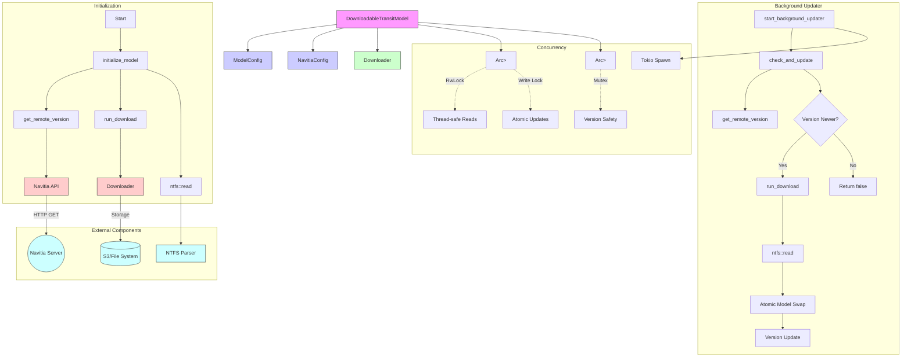

```mermaid
graph TD
    A[DownloadableTransitModel] --> B[ModelConfig]
    A --> C[NavitiaConfig]
    A --> D[Downloader]
    A --> E[Arc<RwLock<Model>>]
    A --> F[Arc<Mutex<String>>]
    
    subgraph Initialization
        G[Start] --> H[initialize_model]
        H --> I[get_remote_version]
        I --> J[Navitia API]
        H --> K[run_download]
        K --> L[Downloader]
        H --> M[ntfs::read]
    end
    
    subgraph Background Updater
        N[start_background_updater] --> O[check_and_update]
        O --> P[get_remote_version]
        O --> Q{Version Newer?}
        Q -->|Yes| R[run_download]
        Q -->|No| S[Return false]
        R --> T[ntfs::read]
        T --> U[Atomic Model Swap]
        U --> V[Version Update]
    end
    
    subgraph External Components
        J -->|HTTP GET| W((Navitia Server))
        L -->|Storage| X[(S3/File System)]
        M --> Y[NTFS Parser]
    end
    
    subgraph Concurrency
        E -.->|RwLock| Z[Thread-safe Reads]
        E -.->|Write Lock| AA[Atomic Updates]
        F -.->|Mutex| AB[Version Safety]
        N --> AC[Tokio Spawn]
    end
    
    style A fill:#f9f,stroke:#333
    style B fill:#ccf,stroke:#333
    style C fill:#ccf,stroke:#333
    style D fill:#cfc,stroke:#333
    style J fill:#fcc,stroke:#333
    style L fill:#fcc,stroke:#333
    style W fill:#cff,stroke:#333
    style X fill:#cff,stroke:#333
    style Y fill:#cff,stroke:#333
```