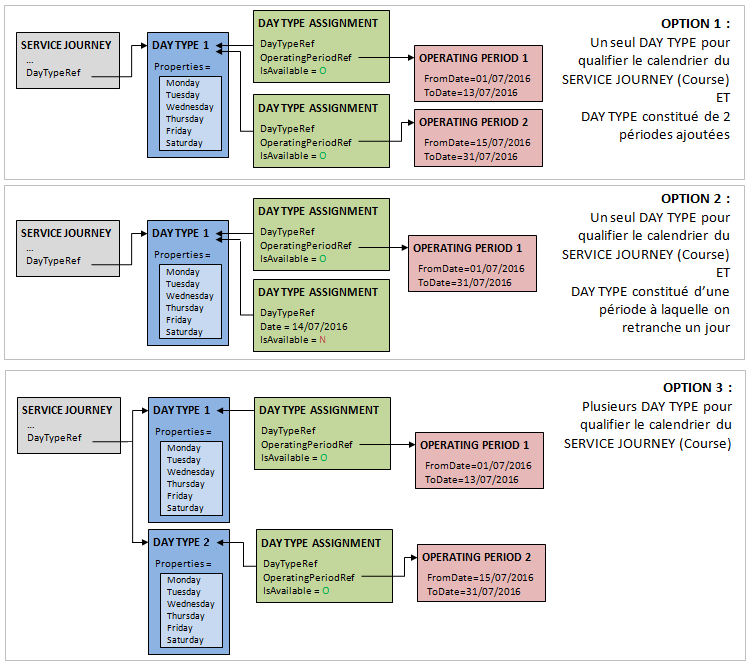

# Netex IDFM reading specification
## Introduction
This document describes how a Netex feed provided by Ile-de-France Mobilités is read in Navitia Transit model (NTM)
and transformed into an [NTFS feed](https://github.com/CanalTP/ntfs-specification/blob/master/ntfs_fr.md).

For the sake of simplicity, the NTM properties that are not specified in the source
data are not described below.

In order to guarantee that the NTFS objects identifiers are unique and stable, each
object id is prefixed with a unique prefix (specified for each datasource), following
the general pattern `<prefix>:<id>`.

## Input data description
This specification assumes that all the required data (time tables for all the lines, stop points and stop areas, transfers, etc.) are provided in one ZIP archive (aka "FICHIERS OFFRE") described in the specification document "NT60-A150701-v1.11-BO-STIF_-_Specification_Technique_d_Interface_NeTEx_pour_la_publication_20190624.docx".

The ZIP archive contains: 
- one **arrets.xml** file
- one **lignes.xml** file, containing the description of lines, networks and companies
- one **correspondances.xml** file (not yet described)
- one folder for each operator (or company) containing:
  + a **calendriers.xml** file, containing the calendars (or validity patterns) used by trips in files **offre_**
  + a **commun.xml** optional file, containing the comments referenced by the operator objects (if needed)
  + several files starting with **offre_** describing the time tables of a specific line in each file

In this document, versions of objects are not handled. The first encountered object description is considered when creating an object.

Each XML file contains a `PublicationDelivery` node, containing a `dataObjects` node. Descriptions below is considering nodes inside this `dataObjects` node.

## Reading of the "arrets.xml" file into stops.txt file
`stops` are provided in the **arrets.xml** file in the node **CompositeFrame/frames/GeneralFrame/** (only one **CompositeFrame** is expected). 
In this netex feed, a `Quay` is included in a "ZDL" `StopPlace`, this "ZDL" `StopPlace` could be included in an "LDA" `StopPlace`.
This connector assumes that all the "ZDL" `StopPlace` are included in one (and only one) "LDA" `StopPlace`.

For french readers: 
- "ZDE" stands for "Zone D'Embarquement" (a boarding position)
- "ZDL" stands for "Zone De Lieux" (a group of boarding position with the same transport mode)
- "LDA" stands for "Lieu D'Arrêt" (a large group of boarding position with several transport modes known with a global name)

### For stop_areas
`stop_area` objects are `StopPlace` nodes of the **arrets.xml** file created in this order:
1. `StopPlace` with a `placeTypes/TypeOfPlace/@ref` attribute with a "LDA" value are used
2. Other `StopPlace` with no `ParentSiteRef` node (corresponding to "ZDL" stops not included in an LDA)

NTFS field | Netex-IDFM element | Mapping rule/Comment
--- | --- | ---
stop_id | *StopPlace/@id* | This field is prefixed. 
stop_name | *StopPlace/Name* | 
location_type | | Fixed value `1` (stop_area)
stop_lat | | see (1) below
stop_lon | | see (1) below

(1) Definition of stop_lat et stop_lon:
As this Netex feed does not provide coordinates for the stop_areas, the stop_lat et stop_lon fields will be set with the coordinate of the centroid of all included stop_points.

**Complementary object_properties**

A complementary property `Netex_StopType` is added to the stop_area with either the "LDA" or "ZDL" value.

NTFS field | Netex-IDFM element | Mapping rule/Comment
--- | --- | ---
object_type |  | fixed value `stop` 
object_id | *StopPlace/@id* | This field is prefixed. 
object_property_name |  | fixed value `Netex_StopType`.
object_property_value | *StopPlace/placeTypes/TypeOfPlace/@ref* | 

**Complementary object_codes**

A complementary code `Netex_ZDL` is added to "LDA" stop_area for each included "ZDL" (ie. `StopPlace` with `ParentSiteRef` node).

NTFS field | Netex-IDFM element | Mapping rule/Comment
--- | --- | ---
object_type |  | fixed value `stop` 
object_id | *StopPlace/ParentSiteRef/@ref* | This field is prefixed. 
object_system |  | fixed value `Netex_ZDL`.
object_code | *StopPlace/@id* | This field is prefixed. 

### For stop_points
`stop_point` objects are `Quay` nodes ("ZDE objects") in the **arrets.xml** file in the node **CompositeFrame/frames/GeneralFrame/**.

NTFS field | Netex-IDFM element | Mapping rule/Comment
--- | --- | ---
stop_id | *Quay/@id* | This field is prefixed. 
stop_name | *Quay/Name* | 
location_type | | Fixed value `0` (stop_point)
stop_lat | Quay/Centroid/Location | see (1) below
stop_lon | Quay/Centroid/Location | see (1) below
parent_station | | stop_id of the corresponding `stop_area`, see (2) below.
stop_timezone | | fixed value `Europe/Paris`
equipment_id | | This value will be self generated by the connector if an equipment object is necessary. See (2) below.

(1) Definition of stop_lat et stop_lon:
The `Quay/Centroid/Location` node contains a position (X, Y) with an EPSG described, for example: 
`<gml:pos srsName="EPSG:2154">662233.0 6861519.0</gml:pos>`
This coordinate is to be converted to a WGS84 coordinate (EPSG:4326).

(2) Definition of the parent_station:
A ZDL `StopPlace` includes the references of it's ZDE in `StopPlace/quays/QuayRef` nodes. The parent_station of a `stop_point` can be either: 
* a ZDL `stop_area` referencing its `Quay`
* an LDA `stop_area` contains it's ZDL references as complementary object_codes, each ZDL referencing its `Quay`

**Definition of the Accessibility of a stop_point**

If the `Quay` node contains a `AccessibilityAssessment/MobilityImpairedAccess` node, an equipment will be generated with:
- a self generated and prefixed `equipment_id`,
- a `wheelchair_boarding` property set to: 
  + Fixed value `1` (accessible) if `MobilityImpairedAccess` has the value `true`,
  + Fixed value `2` (not accessible) if `MobilityImpairedAccess` has the value `false`,
  + Fixed value `0` (unknown) if `MobilityImpairedAccess` has any other value (`partial` or `unknown` for example).

The equipments.txt file will contain at most 3 lines for each possible accessibility definition.

## Reading of the "lignes.xml" file

### networks.txt
`networks` are provided in the nodes **CompositeFrame/frames/ServiceFrame/Network**. There could be multiple `ServiceFrame` to read.

NTFS field | Netex-IDFM element | Mapping rule/Comment
--- | --- | ---
network_id | *Network/@id* | This field is prefixed. 
network_name | *Network/Name* | 
network_timezone | | Fixed value `Europe/Paris`.

### companies.txt
`companies` are provided in the nodes **CompositeFrame/frames/ResourceFrame/organisations/Operator**. There could be multiple `ResourceFrame` to read.

NTFS field | Netex-IDFM element | Mapping rule/Comment
--- | --- | ---
company_id | *Operator/@id* | This field is prefixed. 
company_name | *Operator/Name* | 

### commercial_modes.txt and physical_modes.txt
The transport modes in Netex-IDFM are only defined at the Line level in the node **CompositeFrame/frames/ServiceFrame/lines/Line/**. There could be multiple `ServiceFrame` to read.
`physical_mode_id` and `commercial_mode_id` are **not** prefixed.

TransportMode in Netex-IDFM | physical_mode_id | physical_mode_name | commercial_mode_id | commercial_mode_name 
--- | --- | --- | --- | ---
air | Air | Avion | Air | Avion
bus | Bus | Bus | Bus | Bus
coach | Coach | Autocar | Coach | Autocar
ferry | Ferry | Ferry | Ferry | Ferry
metro | Metro | Métro | Metro | Métro
rail | LocalTrain | Train régional / TER | LocalTrain | Train régional / TER
trolleyBus | Tramway | Tramway | TrolleyBus | TrolleyBus
tram | Tramway | Tramway | Tramway | Tramway
water | Boat | Navette maritime / fluviale | Boat | Navette maritime / fluviale
cableway | Tramway | Tramway | CableWay | CableWay
funicular | Funicular | Funiculaire | Funicular | Funiculaire
lift | Bus | Bus | Bus | Bus
other | Bus | Bus | Bus | Bus

### lines.txt
`lines` are provided in the nodes **CompositeFrame/frames/ServiceFrame/lines/Line**. There could be multiple `ServiceFrame` to read.

NTFS field | Netex-IDFM element | Mapping rule/Comment
--- | --- | ---
line_id | *Line/@id* | This field is prefixed. 
network_id | *Network/@id* | id of the network containing a reference to this line in `Network/members/LineRef/@ref`. This field is prefixed. 
line_code | *Line/ShortName* | 
line_name | *Line/Name* | 

If the node `Line/PrivateCode` is available, the content of this node is added as an `object_code` for this line with `object_system` set at `Netex_PrivateCode`.

If a node `Line/keyList/keyValue/Key` contains the value `Accessibility`, a `trip_property` will be specified for all the trips of the line (see trip_properties.txt).

## Reading of each folder
In a **offre_** file, 2 **GeneralFrame** are expected in a **CompositeFrame/frames** node:
* one with a `TypeOfFrameRef/@ref` containing the string `NETEX_STRUCTURE`
* one with a `TypeOfFrameRef/@ref` containing the string `NETEX_HORAIRE`
In the following chapters, the **CompositeFrame/frames/GeneralFrame/members** is ommitted.

### routes.txt
`routes` are provided in each **offre_** file in the nodes **Route**. 

NTFS field | Netex-IDFM element | Mapping rule/Comment
--- | --- | ---
route_id | *Route/@id* | This field is prefixed. 
route_name | *Route/Name* | 
direction_type | *Route/DirectionType* | The value of this field is used without transformation.
destination_id |  | The `DirectionRef` of the Route doesn't link to a stop (neither stop_point nor stop_area), thus its value is not used.
line_id | *Route/LineRef/@ref* | This field is prefixed. 

**ServiceJourneyPattern references**
All ServiceJourneyPattern of a `route` are stored as complementary `object_codes`. ServiceJourneyPattern nodes are listed in the same parent node as Route nodes.

NTFS field | Netex-IDFM element | Mapping rule/Comment
--- | --- | ---
object_type |  | fixed value `route` 
object_id | *ServiceJourneyPattern/RouteRef/@ref* | This field is prefixed. 
object_system |  | fixed value `Netex_ServiceJourneyPattern`
object_code | *ServiceJourneyPattern/@id* | The value of this field is used without transformation.

### trips.txt
`trips` are described in each **offre_** file in the nodes **ServiceJourney**. 

NTFS field | Netex-IDFM element | Mapping rule/Comment
--- | --- | ---
route_id | *ServiceJourney/JourneyPatternRef/@ref* | route_id of the Route containing the JourneyPatternRef as an object_code.
service_id |  | Defined using `ServiceJourney/DayTypeRef`, see (calendar.txt and calendar_dates.txt)[]
trip_id | *ServiceJourney/@id* | This field is prefixed. 
trip_headsign | *ServiceJourney/DestinationDisplayRef* | Content of the `DestinationDisplay/FrontText` node. If not available, the name of the `stop_point` of the last `stop_time` is used.
trip_short_name | *ServiceJourney/DestinationDisplayRef* | Content of the `DestinationDisplay/PublicCode` node. If not available, this field is empty.
company_id | *ServiceJourney/OperatorRef* | if *ServiceJourney/OperatorRef* is not defined, use *Line/OperatorRef* in [*lines.xml*](#linestxt) file. This field is prefixed.
physical_mode_id | *Line/TransportMode* | see physical_modes definition
trip_property_id |  | see [trip_properties.txt](#trip_propertiestxt)

**comment_links for a trip**
If one (or more) `noticeAssignments/NoticeAssignment/NoticeRef` is available in the `ServiceJourney`, a `comment_link` will be created as follow.

NTFS field | Netex-IDFM element | Mapping rule/Comment
--- | --- | ---
object_id | *ServiceJourney/@id* | This field is prefixed. 
object_type |  | Fixed value `trip`
comment_id | *noticeAssignments/NoticeAssignment/NoticeRef* | This field is prefixed. 

### trip_properties.txt
In the Line declaration (cf. `lines.txt`), if a node `Line/keyList/keyValue/Key` contains the value `Accessibility`, a `trip_property` will be specified for all the trips of the line.

NTFS field | Netex-IDFM element | Mapping rule/Comment
--- | --- | ---
trip_property_id | *Line/@id* | The id of the line is used to create this object. This field is prefixed. 
wheelchair_accessible | `Line/keyList/keyValue/Value` | See (1) below.

wheelchair_accessible value: 
* If source value is "0", then this property is set to "2" (not accessible),
* If source value is "1", then this property is set to "1" (accessible),
* else this property is set to "0" (unknown)

### stop_times.txt
`stop_times` of a trip are listed in the `passingTimes/TimetabledPassingTime` nodes of a `ServiceJourney` (cf. `trip` definition).

NTFS field | Netex-IDFM element | Mapping rule/Comment
--- | --- | ---
trip_id | *ServiceJourney/@id* | This field is prefixed. 
stop_sequence | | Auto-incremented field starting with `0` for the first stop_time
stop_id | | See (1) below
arrival_time | *TimetabledPassingTime/ArrivalTime* | If `TimetabledPassingTime/DepartureDayOffset` value is >0, arrival_time is incremented 24 hours for each day offset. 
departure_time | *TimetabledPassingTime/DepartureTime* | If `TimetabledPassingTime/DepartureDayOffset` value is >0, departure_time is incremented 24 hours for each day offset. 
boarding_duration | | Fixed value `0`
alighting_duration | | Fixed value `0`
pickup_type | | See (2) below
drop_off_type | | See (2) below
local_zone_id | | See (3) below

(1) Definition of the stop_id of a stop_time:

1. Find the `ServiceJourneyPattern` referenced by `ServiceJourney/JourneyPatternRef/@ref` of the `TimetabledPassingTime`.
2. The `ServiceJourneyPattern/pointsInSequence/StopPointInJourneyPattern` node of the same position as the stop_time is used.
3. The `StopPointInJourneyPattern/ScheduledStopPointRef/@ref` attribute is searched in the `PassengerStopAssignment/ScheduledStopPointRef/@ref` attribute of all the `PassengerStopAssignment` nodes of the file
4. The `PassengerStopAssignment/QuayRef/@ref` is the stop_id of the stop_point (with a prefix).

(2) Definition of pickup_type and drop_off_type:

In the `ServiceJourneyPattern/pointsInSequence/StopPointInJourneyPattern` corresponding to this `stop_time` (see `(1)`):
* if the `ForBoarding` node is existing and with a `False` value, `pickup_type` is set to "1" (no boarding)
* else `pickup_type` is set to "0" (regular boarding)
`drop_off_type` is set using the same method and using the `ForAlighting` node.

(3) Definition of local_zone_id:

The declaration of those zones is made in the nodes `RoutingConstraintZone` of the **offre_** file.
The `local_zone_id` is specified with an auto-incremented integer. Each `RoutingConstraintZone/@id` is associated with a new integer. 
This `RoutingConstraintZone` contains a list of `ScheduledStopPointRef` (in `RoutingConstraintZone/members/ScheduledStopPointRef/@ref`). If a stop_time corresponds to one of those `ScheduledStopPointRef`, the `local_zone_id` is set to the associated integer.

### calendar.txt and calendar_dates.txt
Active days of `trips` are decribed in **calendriers.xml** of each folder in the `GeneralFrame/members/DayType` node (with the use of `DayTypeAssignment` and `OperatingPeriod`).

A `trip` references one or several `DayType` in `ServiceJourney/dayTypes/DayTypeRef/@ref`.
The `service_id` property of the calendar in the NTFS is specified by an auto-incremented integer (this field is prefixed).

Active dates of the calendar are specified by:
- `DayType` nodes describing the active days of a week
  + days of the week are listed in `DayType/properties/PropertyOfDay/DaysOfWeek nodes`. 
  + Expected values MUST be one of `Monday`, `Tuesday`, `Wednesday`, `Thursday`, `Friday`, `Saturday`, `Sunday`.
- `OperatingPeriod` nodes describing periods (basically a begining date and an end date) referenced in `DayTypeAssignment`
- `DayTypeAssignment` nodes with 2 possible uses:
  + Activate or deactivate a specific day on a DayType (with the nodes `IsAvailable` and `Date`)
  + Apply the active days of the referenced DayType on an `OperatingPeriod`

All resulting calendars are to be restricted between `ValidBetween/FromDate` and `ValidBetween/ToDate` specified at the top level of the file in `GeneralFrame`.

Be careful: Definition of calendars and exceptions in calendar_dates may not be the same definition as the one in the Netex-IDFM files, but the resulting active dates will be the same.

Here is 3 possible modelizations in Netex-IDFM of a calendar running from 2016-07-01 to 2016-07-31 from monday to saturday except on 2016-07-14:

### comments.txt
`comments` are provided in **commun.xml** file in the nodes **GeneralFrame/members/Notice**.

NTFS field | Netex IDFM element | Mapping rule/Comment
--- | --- | ---
comment_id | *Notice/@id* | This field is prefixed.
comment_name | *Notice/Text* |

### transfers.txt
Transfers are not yet provided in the Netex IDFM Data feed. Transfers need to be generated afterward to provide accurate trip planning.